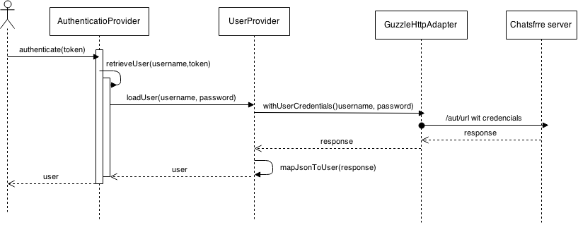

Auth proccess
-------------

As you can see in the picture, an user asks to authenticate a token (UserPasswordToken). The auth provicer pases to the user provider the username and the password. The user provider then makes a call to the API server, using the http client, to fetch te userdata and create a User instance. The user is then passed back to the auth provider, making the proccess as valid.