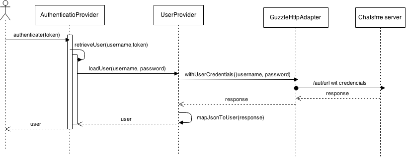

ChateaSecureBundle
==================

This bundle provides authentication agains http://chatsfree.net for Symfony2 apps. The intent of this document is to make you familiar with the instalation, configuration and how the authentication proccess works.

Installation
------------

Add do your ```composer.yml``` file the following ```"antwebes/chatea-secure-bundle": "dev-master"``` line and then execute on your terninal:

```$ composer install```

In the ```app/AppKernel.php``` register the bundle:

```
<?php

use Symfony\Component\HttpKernel\Kernel;
use Symfony\Component\Config\Loader\LoaderInterface;

class AppKernel extends Kernel
{
    
    public function registerBundles()
    {
        $bundles = array(
            //...
            new Ant\Bundle\ChateaSecureBundle\ChateaSecureBundle(),
            //...
        );
        
        //...

        return $bundles;
    }
}
```

Configuration
-------------

In the configuration (```app/config/config.yml``` for example) you need to configure the ```chatea_secure``` section like this:

```
chatea_secure:
    app_auth:
        enviroment: dev|prod #the enfivonment you want to execute
        client_id: APP_CLIENT_ID #the client id of chatsfree to call the api
        secret: APP_SECRET_ID #secrete for the client
    api_endpoint: API_ENDPOINT #the endpoint url, generally https://api.chatsfree.net/
```

Auth proccess
-------------



As you can see in the picture, an user asks to authenticate a token (UserPasswordToken). The auth provicer pases to the user provider the username and the password. The user provider then makes a call to the API server, using the http client, to fetch te userdata and create a User instance. The user is then passed back to the auth provider, making the proccess as valid.